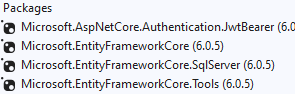

# University management system

### Proposal

1.  3 types of user roles (Administrator, teacher, student)
2.  The administrator will create courses (code, name, description)
3. The administrator will create teacher (name, email) and student (name, email), etc.
4. A notification mail should be sent to the given email address with system access credentials.
5. Teachers will select courses that they will be teaching and the administrator will approve (If rejected the selection   from admin then the student should be notified)
6.  Students will select their preferred course to take which will be shown along with the teacher who will take that class(there should be a credit limit. Students should not be able to select courses more than the limit. if rejected the selection from admin then the student should be notified)

## Backend (API)

### Asp.net core webapi (version 6 )

### Packages 

 
 ## Process to run the project.
 1. First open visual studio(2022) then open the sln file.
 2. Then from nuget package manage solution install entityframeworkcore, sqlite, tools the exact package version provided.
 3. open PMC run `add-migration createdb`
 4. then run `update-database`
 5. then ready to go just run the project.
 6. After running the project there will be swagger UI interface there we can test our api.

 ## Frontend

This project was generated with [Angular CLI](https://github.com/angular/angular-cli) version 13.2.5.

## Development server
please install the angular module by `npm install` either it won't run.
npm install will install all of the node modules we need for this project.

Run `ng serve` for a dev server. Navigate to `http://localhost:4200/`. The app will automatically reload if you change any of the source files.

